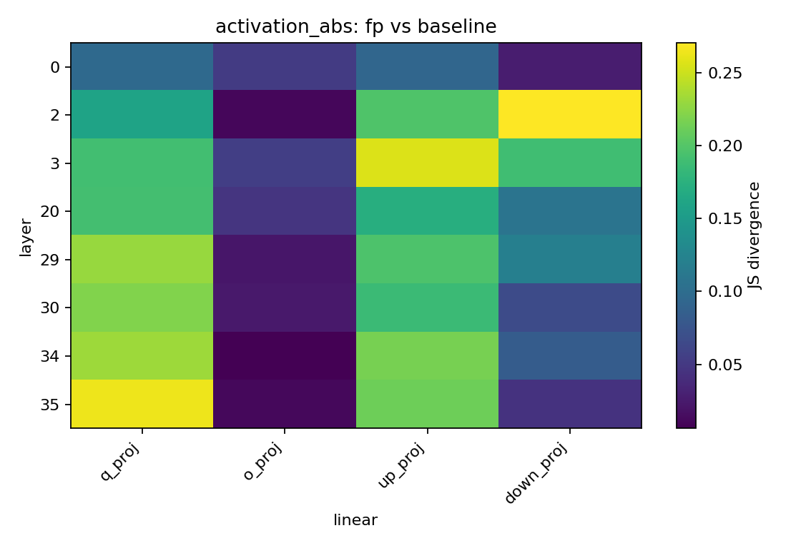
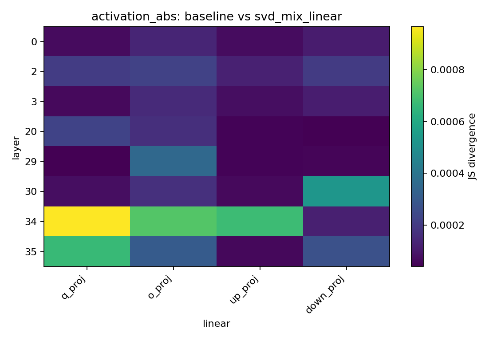
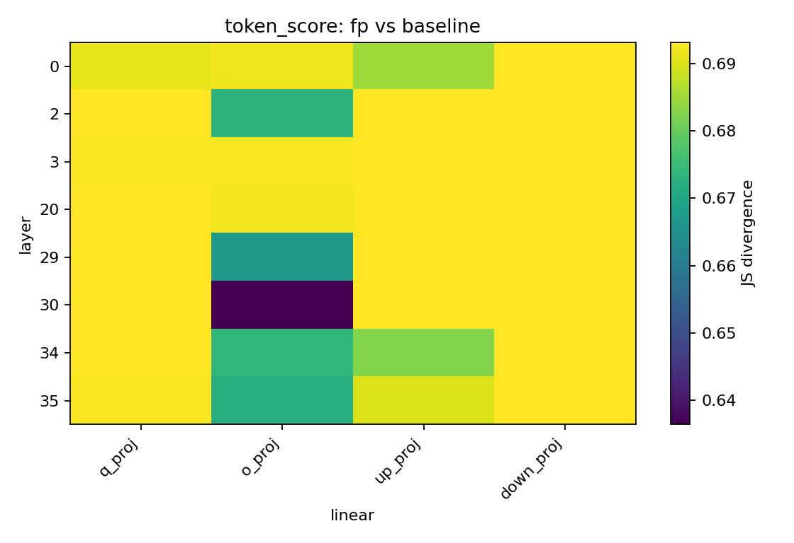
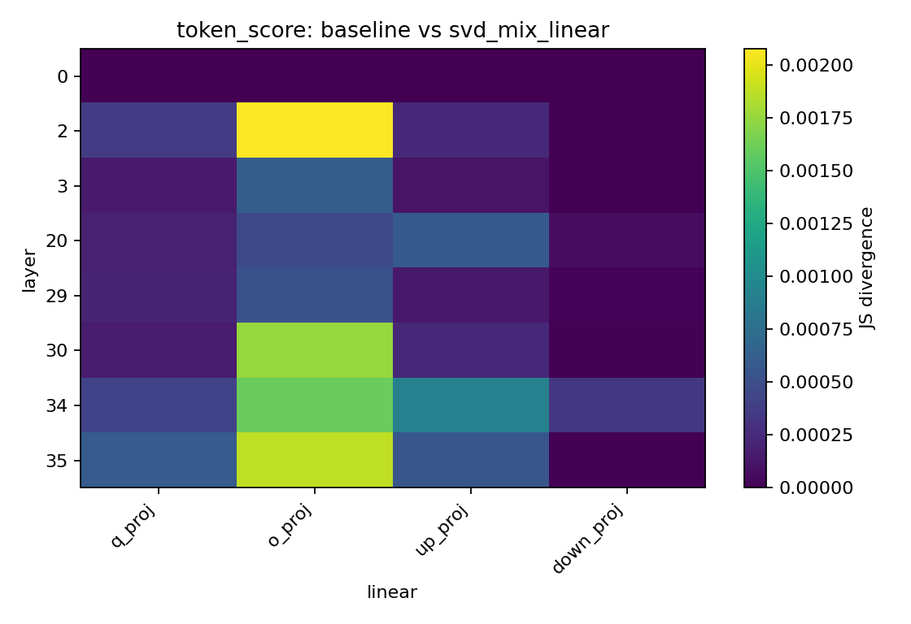
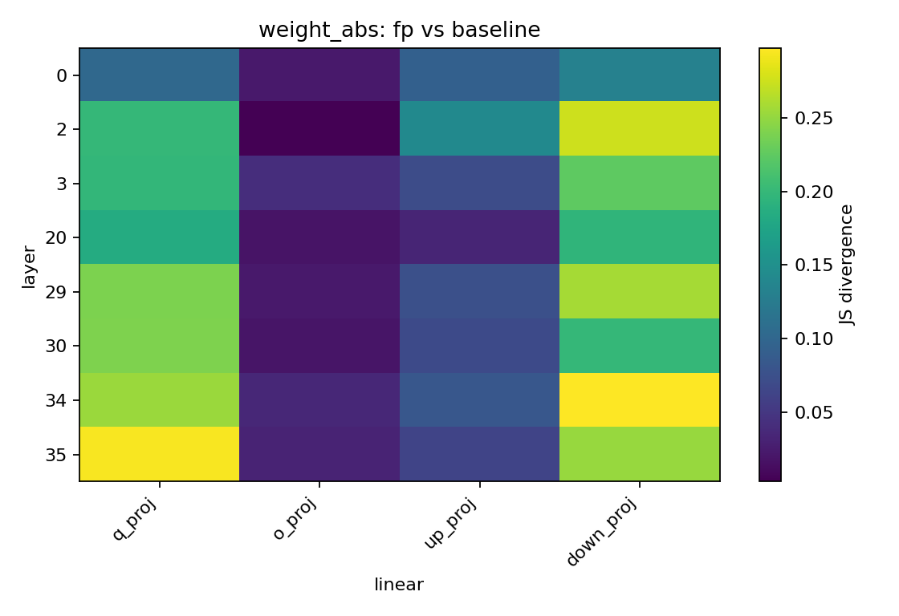
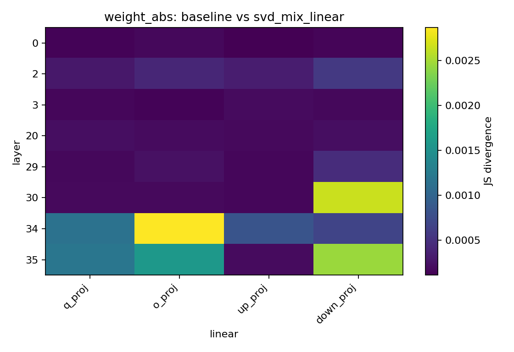
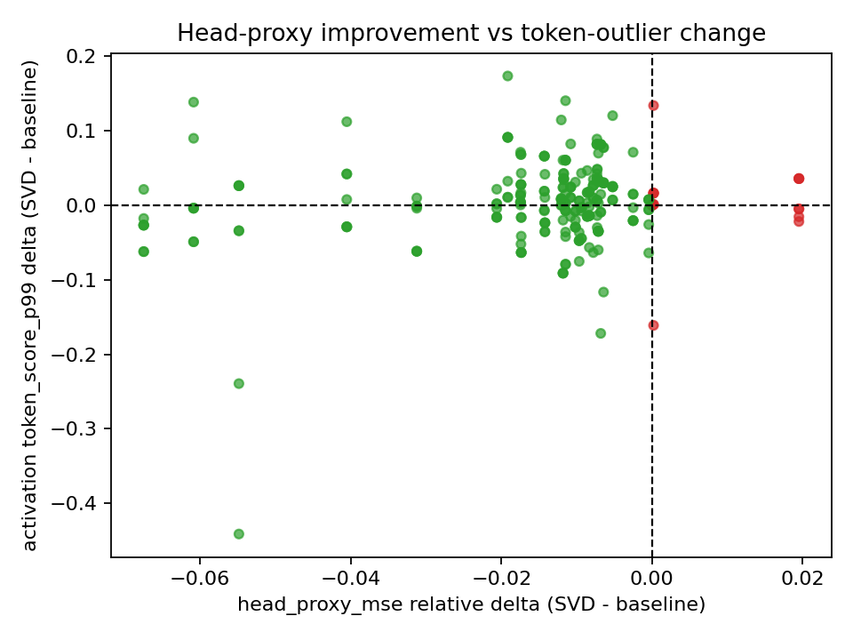

# Qwen2.5-3B Base KL/JS 分布差异与 Head-Proxy 对齐诊断报告

## 1. 实验目的

上一轮 outlier 分布诊断已经说明：established FlatQuant baseline 相比 FP 会显著压低 activation/token outlier，并显著提升 A4/W4 量化友好性；但 SVD A+B 相比 baseline 没有明显进一步改善普通分布指标。

本轮实验继续完成两个后续问题：

1. 用 KL / JS 风格的分布距离，定量比较 FP、baseline、SVD A+B 三者的分布差异。
2. 把已有训练日志中的 `plain_mse` / `head_proxy_mse` 和上一轮 outlier / SQNR 指标对齐，检查“head-sensitive 方向改善”是否伴随普通分布指标改善。

这对应老师提到的两类要求：

- 像蒸馏一样算 KL 散度，看前后分布到底有没有变化。
- 看 SVD 是否保留了语义更重要的部分，同时也看普通分布和量化信噪比是否同步变好。

## 2. 为什么用 JS Divergence

KL divergence 可以衡量两个分布的差异，但原始 KL 有两个实际问题：

- 它不对称，即 `KL(P || Q)` 和 `KL(Q || P)` 不一样。
- 如果 histogram 某些 bin 的概率很小，数值可能不稳定。

因此本轮同时计算 KL 和 JS divergence，并主要汇报 JS divergence。JS divergence 是基于 KL 的对称版本，更适合做 histogram 分布差异比较。

JS 越大，说明两个分布差异越大。JS 越接近 0，说明两个分布越接近。

## 3. 对比对象

本轮仍然比较三种状态：

| 状态 | 含义 | 来源 |
| --- | --- | --- |
| `fp` | 原始浮点 Qwen2.5-3B base | `./modelzoo/Qwen/Qwen2.5-3B` |
| `baseline` | established FlatQuant baseline | `outputs/Qwen2.5-3B/w4a4/qwen25_3b_base_w4a4kv4_lwc_lac_full_headmse_gpu0/` |
| `svd_mix_linear` | A+B SVD-FlatQuant formal run | `outputs/Qwen2.5-3B/w4a4/qwen25_3b_base_w4a4kv4_lwc_lac_svd_mix_linear_a0p5_full_eval_gpu3_20260415_180145/` |

训练日志来源：

| 状态 | 日志 |
| --- | --- |
| baseline | `outputs/Qwen2.5-3B/w4a4/qwen25_3b_base_w4a4kv4_lwc_lac_full_headmse_gpu0/log_rank0_20260412_114247.txt` |
| SVD A+B | `outputs/Qwen2.5-3B/w4a4/qwen25_3b_base_w4a4kv4_lwc_lac_svd_mix_linear_a0p5_full_eval_gpu3_20260415_180145/log_rank0_20260415_180148.txt` |

上一轮 outlier 指标来源：

- `outputs/diagnostics/qwen25_3b_base_outlier_dist_baseline_vs_svd_mix_linear_20260528_005938/`

## 4. 诊断脚本与输出

新增脚本：

- `diagnostics/qwen25_kl_js_head_alignment.py`

运行命令：

```bash
CUDA_VISIBLE_DEVICES=0 conda run -n flatquant_svd python diagnostics/qwen25_kl_js_head_alignment.py --nsamples 4
```

输出目录：

- `outputs/diagnostics/qwen25_3b_base_kl_js_head_alignment_20260529_234646/`

主要输出：

- `summary.json`
- `kl_js_distribution_rows.csv`
- `head_outlier_alignment_rows.csv`
- JS heatmap
- `head_proxy_mse` 改善与 token outlier 变化的 scatter plot

## 5. KL/JS 分布比较方法

本轮对代表性层和模块重新采样分布。代表性层为：

- layer `0`
- layer `2`
- layer `3`
- layer `20`
- layer `29`
- layer `30`
- layer `34`
- layer `35`

代表性模块为：

- `q_proj`
- `o_proj`
- `up_proj`
- `down_proj`

比较的分布类型：

- `weight_abs`: weight 绝对值分布
- `activation_abs`: activation 绝对值分布
- `token_score`: token outlier score 分布

比较的状态对：

- `fp` vs `baseline`
- `baseline` vs `svd_mix_linear`
- `fp` vs `svd_mix_linear`

## 6. JS Divergence 全局结果

### 6.1 Activation 绝对值分布

| Pair | Mean JS | Median JS | Max JS | Count |
| --- | ---: | ---: | ---: | ---: |
| FP vs Baseline | `0.132993` | `0.139836` | `0.270863` | `32` |
| Baseline vs SVD A+B | `0.000223` | `0.000131` | `0.000967` | `32` |
| FP vs SVD A+B | `0.134866` | `0.136159` | `0.276501` | `32` |

### 6.2 Token Outlier Score 分布

| Pair | Mean JS | Median JS | Max JS | Count |
| --- | ---: | ---: | ---: | ---: |
| FP vs Baseline | `0.687812` | `0.693089` | `0.693147` | `32` |
| Baseline vs SVD A+B | `0.000444` | `0.000214` | `0.002077` | `32` |
| FP vs SVD A+B | `0.687720` | `0.693147` | `0.693147` | `32` |

### 6.3 Weight 绝对值分布

| Pair | Mean JS | Median JS | Max JS | Count |
| --- | ---: | ---: | ---: | ---: |
| FP vs Baseline | `0.136758` | `0.117388` | `0.297434` | `32` |
| Baseline vs SVD A+B | `0.000585` | `0.000201` | `0.002869` | `32` |
| FP vs SVD A+B | `0.137609` | `0.116241` | `0.307274` | `32` |

## 7. JS 结果解释

JS divergence 结果非常明确：

1. FP 到 baseline 的分布变化很大。
2. FP 到 SVD A+B 的分布变化也很大。
3. baseline 到 SVD A+B 的分布变化极小。

特别是 token outlier score：

- FP vs baseline mean JS: `0.687812`
- baseline vs SVD A+B mean JS: `0.000444`

这说明普通 token outlier 分布几乎完全是由 FlatQuant baseline 改变的；A+B SVD 在 baseline 基础上没有明显再改变 token outlier 分布。

这与上一轮 quantile / SQNR 结果一致：SVD A+B 不是一个强的分布 flattening 方法。

## 8. Baseline vs SVD A+B 的最大 JS 差异位置

虽然 baseline 和 SVD A+B 整体非常接近，但仍有一些模块差异相对最大。

### 8.1 Activation 绝对值分布

| Layer | Linear | JS(Baseline, SVD A+B) | JS(FP, Baseline) |
| --- | --- | ---: | ---: |
| 34 | `q_proj` | `0.000967` | `0.232297` |
| 34 | `o_proj` | `0.000719` | `0.005975` |
| 34 | `up_proj` | `0.000675` | `0.216991` |
| 35 | `q_proj` | `0.000666` | `0.264367` |
| 30 | `down_proj` | `0.000528` | `0.066516` |

### 8.2 Token Outlier Score 分布

| Layer | Linear | JS(Baseline, SVD A+B) | JS(FP, Baseline) |
| --- | --- | ---: | ---: |
| 2 | `o_proj` | `0.002077` | `0.673013` |
| 35 | `o_proj` | `0.001875` | `0.672019` |
| 30 | `o_proj` | `0.001752` | `0.636439` |
| 34 | `o_proj` | `0.001599` | `0.673909` |
| 34 | `up_proj` | `0.000903` | `0.682609` |

### 8.3 Weight 绝对值分布

| Layer | Linear | JS(Baseline, SVD A+B) | JS(FP, Baseline) |
| --- | --- | ---: | ---: |
| 34 | `o_proj` | `0.002869` | `0.036043` |
| 30 | `down_proj` | `0.002645` | `0.198799` |
| 35 | `down_proj` | `0.002450` | `0.252302` |
| 35 | `o_proj` | `0.001577` | `0.032233` |
| 35 | `q_proj` | `0.001189` | `0.294674` |

即使在差异最大的模块上，baseline vs SVD A+B 的 JS 也远小于 FP vs baseline。

## 9. Head-Proxy 与 Outlier/SQNR 对齐方法

第二部分分析将两类数据对齐：

1. 从训练日志读取每层 final epoch 的：
   - `plain_mse`
   - `head_proxy_mse`
2. 从上一轮 outlier 诊断读取每个 layer-linear 的：
   - activation token outlier 指标
   - activation A4 SQNR
   - weight outlier 指标
   - weight W4 SQNR

然后计算：

```text
delta = SVD A+B - baseline
```

如果 `head_proxy_mse_delta < 0`，表示 SVD A+B 在 head-sensitive error 上更好。

如果普通 outlier ratio 或 MSE 的 delta 小于 0，表示普通分布指标更好。

如果 SQNR 的 delta 大于 0，表示量化信噪比更好。

## 10. Head-Proxy 与普通分布指标的全局对齐结果

总模块数：`252`

| 指标 | 改善模块数 |
| --- | ---: |
| `head_proxy_mse` improved | `231 / 252` |
| `plain_mse` improved | `70 / 252` |
| activation `token_score_p99` improved | `106 / 252` |
| activation `a4_sym_token_sqnr_db` improved | `94 / 252` |
| weight `abs_max_over_p99` improved | `146 / 252` |
| weight `w4_sym_per_out_sqnr_db` improved | `66 / 252` |

这个结果说明：

- SVD A+B 在绝大多数层上确实改善了 `head_proxy_mse`。
- 但是普通 `plain_mse` 只在少数层改善。
- activation token outlier 和 A4 SQNR 也没有随 `head_proxy_mse` 大规模同步改善。
- weight outlier ratio 有一定改善，但 W4 SQNR 没有同步改善。

## 11. 按 Head-Proxy 是否改善分组

### 11.1 `head_proxy_mse` 改善的模块

模块数：`231`

| 指标 | Mean Delta | Median Delta | 越大/越小越好 |
| --- | ---: | ---: | --- |
| activation `token_score_p99` | `0.004186` | `0.006672` | 越小越好 |
| activation `a4_sym_token_sqnr_db` | `-0.005531` | `-0.005932` | 越大越好 |
| weight `abs_max_over_p99` | `-0.075407` | `-0.014706` | 越小越好 |
| weight `w4_sym_per_out_sqnr_db` | `-0.020853` | `-0.013526` | 越大越好 |

### 11.2 `head_proxy_mse` 未改善的模块

模块数：`21`

| 指标 | Mean Delta | Median Delta | 越大/越小越好 |
| --- | ---: | ---: | --- |
| activation `token_score_p99` | `0.003850` | `0.000000` | 越小越好 |
| activation `a4_sym_token_sqnr_db` | `-0.015904` | `0.000000` | 越大越好 |
| weight `abs_max_over_p99` | `-0.190687` | `0.000000` | 越小越好 |
| weight `w4_sym_per_out_sqnr_db` | `0.033583` | `0.000000` | 越大越好 |

这个分组说明：即使在 `head_proxy_mse` 改善的模块里，activation token outlier 和 activation SQNR 也没有同步改善。也就是说，head-sensitive 方向上的改善和普通分布 flattening 不是同一件事。

## 12. 代表性 Late-Layer 对齐结果

### 12.1 Layer 20

| Linear | Head Proxy Rel Delta | Plain MSE Rel Delta | Token Score Delta | A4 SQNR Delta |
| --- | ---: | ---: | ---: | ---: |
| `q_proj` | `-0.0312` | `-0.0141` | `-0.0619` | `-0.0000` |
| `o_proj` | `-0.0312` | `-0.0141` | `-0.0042` | `-0.0123` |
| `up_proj` | `-0.0312` | `-0.0141` | `-0.0014` | `-0.0062` |
| `down_proj` | `-0.0312` | `-0.0141` | `0.0096` | `-0.0114` |

Layer 20 中，`head_proxy_mse` 和 `plain_mse` 都改善，但 A4 SQNR 基本没有改善。

### 12.2 Layer 34

| Linear | Head Proxy Rel Delta | Plain MSE Rel Delta | Token Score Delta | A4 SQNR Delta |
| --- | ---: | ---: | ---: | ---: |
| `q_proj` | `-0.0405` | `0.0252` | `-0.0291` | `-0.0006` |
| `o_proj` | `-0.0405` | `0.0252` | `0.0075` | `-0.0866` |
| `up_proj` | `-0.0405` | `0.0252` | `0.0417` | `-0.0388` |
| `down_proj` | `-0.0405` | `0.0252` | `0.1118` | `-0.0437` |

Layer 34 中，`head_proxy_mse` 改善约 `4.05%`，但 `plain_mse` 变差约 `2.52%`，并且多数模块的 token outlier 或 A4 SQNR 没有改善。

### 12.3 Layer 35

| Linear | Head Proxy Rel Delta | Plain MSE Rel Delta | Token Score Delta | A4 SQNR Delta |
| --- | ---: | ---: | ---: | ---: |
| `q_proj` | `-0.0609` | `0.0371` | `-0.0041` | `-0.0335` |
| `o_proj` | `-0.0609` | `0.0371` | `0.1381` | `-0.0535` |
| `up_proj` | `-0.0609` | `0.0371` | `-0.0492` | `0.0325` |
| `down_proj` | `-0.0609` | `0.0371` | `0.0896` | `-0.0268` |

Layer 35 是 final transformer block。这里 `head_proxy_mse` 改善约 `6.09%`，但 `plain_mse` 变差约 `3.71%`。这再次说明 A+B 的主要效果是改变 head-sensitive error geometry，而不是普通分布整体变好。

## 13. 图

### 13.1 Activation Abs JS Heatmap

FP vs Baseline：



Baseline vs SVD A+B：



### 13.2 Token Score JS Heatmap

FP vs Baseline：



Baseline vs SVD A+B：



### 13.3 Weight Abs JS Heatmap

FP vs Baseline：



Baseline vs SVD A+B：



### 13.4 Head-Proxy 改善与 Token Outlier 变化散点图



## 14. 本轮结论

本轮进一步诊断给出三个结论。

第一，KL/JS 分布距离确认：FP 到 baseline 的分布变化很大，而 baseline 到 SVD A+B 的分布变化极小。这说明 FlatQuant baseline 是主要的 distribution-transform 方法，A+B SVD 没有在 baseline 上进一步显著改变普通分布。

第二，`head_proxy_mse` 与普通 outlier / SQNR 不同步。A+B SVD 在 `231 / 252` 个 layer-linear 对应模块上改善了 `head_proxy_mse`，但 activation token outlier 只在 `106 / 252` 个模块改善，activation A4 SQNR 只在 `94 / 252` 个模块改善。

第三，late layers 的结果最能说明问题：Layer 34 和 Layer 35 的 `head_proxy_mse` 改善明显，但 `plain_mse` 变差，activation token outlier 和 SQNR 也没有系统改善。

因此，当前最准确的机制解释是：

- FlatQuant baseline 负责把 outlier-heavy distribution 变成量化友好的分布。
- SVD A+B 主要改变的是 output-head-sensitive error geometry。
- SVD A+B 的 head-sensitive 改善没有同步转化为普通分布 flattening 或 SQNR 改善。
- 这解释了为什么它能在 `head_proxy_mse` 上看起来有作用，但最终 PPL / zero-shot 没有全面胜出 baseline。

## 15. 后续建议

如果继续推进 SVD 路线，下一步不应只继续调 SVD loss 权重，而应该设计一个同时约束两类目标的方法：

1. 保留 `head_proxy_mse` 的改善。
2. 不损害甚至改善 `plain_mse`。
3. 不损害 activation token outlier 和 A4/W4 SQNR。

一种自然方向是构造联合目标或约束项，例如在 mixed SVD loss 之外加入显式的 activation quantization noise / SQNR proxy，避免只优化 head-sensitive geometry 而牺牲普通量化分布。
