# Qwen2.5-3B Base Outlier 分布诊断报告

## 1. 动机

本轮诊断是在 SVD / A+B 实验只带来较小的最终 PPL 和 zero-shot 精度变化之后加入的。

这次要回答的问题不是最终指标是否变化，而是方法是否按照预期改变了与量化相关的分布：

- weight outlier 是否减弱
- token / activation outlier 是否减弱
- 变换后的 tensor 是否变得更适合量化
- A+B SVD-FlatQuant 是否在 established FlatQuant baseline 之外带来了额外的分布层面效果

这对应老师的建议：新的量化方法不能只看最终指标，也应该从分布角度分析。具体来说，需要看方法前后的 tensor，结合数值指标和可视化图，检查分布是否变得更 uniform、更少被 outlier 主导。

## 2. 从老师建议中提取出的实验要求

从老师意见中提取出的有效实验要求是：

1. 比较变换前和变换后。
2. 检查加入 SVD 是否真的影响 weight / activation 分布，因为最终指标变化很小可能掩盖内部效果很弱的问题。
3. 使用多尺度可视化，而不是只看一个 scalar。
4. 除了图以外，还要使用具体指标。
5. 加入信噪比风格的量化指标。
6. 将 KL 风格的分布比较作为后续扩展。
7. 检查 SVD 方法是否通过降低相应 loss 来保留语义更重要的部分。

本报告直接覆盖要求 1-5，并把要求 7 和已有的 `head_proxy_mse` 诊断联系起来。KL 风格的分布比较被列为后续工作，因为本轮使用的是 histogram / quantile / SQNR 诊断，而不是 KL divergence。

## 3. 对比状态

诊断在 `Qwen2.5-3B` base 上比较了三种状态：

| 状态 | 含义 | 来源 |
| --- | --- | --- |
| `fp` | FlatQuant 变换前的原始浮点模型 | `./modelzoo/Qwen/Qwen2.5-3B` |
| `baseline` | established normal-scale FlatQuant baseline | `outputs/Qwen2.5-3B/w4a4/qwen25_3b_base_w4a4kv4_lwc_lac_full_headmse_gpu0/` |
| `svd_mix_linear` | A+B SVD-FlatQuant，使用 mixed SVD loss 和 linear layer schedule | `outputs/Qwen2.5-3B/w4a4/qwen25_3b_base_w4a4kv4_lwc_lac_svd_mix_linear_a0p5_full_eval_gpu3_20260415_180145/` |

诊断复用了已有的 `flat_parameters.pth` 文件，没有重新运行 15-epoch calibration。

## 4. 诊断脚本和输出

脚本：

- `diagnostics/qwen25_outlier_distribution.py`

运行环境：

- conda 环境：`flatquant_svd`
- GPU：`0`

命令：

```bash
CUDA_VISIBLE_DEVICES=0 conda run -n flatquant_svd python diagnostics/qwen25_outlier_distribution.py --nsamples 4
```

输出目录：

- `outputs/diagnostics/qwen25_3b_base_outlier_dist_baseline_vs_svd_mix_linear_20260528_005938/`

主要输出文件：

- `summary.json`
- `weight_stats_all.csv`
- `activation_stats_all.csv`
- 各状态的 CSV 文件
- weight / activation 诊断 heatmap
- 代表性 weight / activation histogram

## 5. 收集的 Tensor 范围

对每个 transformer layer，诊断收集了以下模块的统计信息：

- `q_proj`
- `k_proj`
- `v_proj`
- `o_proj`
- `gate_proj`
- `up_proj`
- `down_proj`

代表性 histogram 层：

- layer `0`
- layer `2`
- layer `3`
- layer `20`
- layer `29`
- layer `30`
- layer `34`
- layer `35`

这些代表性层和之前 `head_proxy_mse` 诊断的风格保持一致，覆盖 early、middle 和 late layers。

## 6. 指标

### 6.1 Weight 指标

对每个 linear weight tensor：

- `abs_max`
- `mean_abs`
- `std`
- `p50_abs`
- `p90_abs`
- `p99_abs`
- `p999_abs`
- `abs_max_over_p99`
- `p999_over_p50`
- `per_out_max_over_median`
- `w4_sym_per_out_mse`
- `w4_sym_per_out_sqnr_db`

`w4_sym_per_out_sqnr_db` 是 per-output-channel symmetric W4 fake quantization 的信噪比风格指标。

### 6.2 Activation / Token 指标

对每个 linear module 的输入 activation：

- `abs_max`
- `p50_abs`
- `p90_abs`
- `p99_abs`
- `p999_abs`
- `abs_max_over_p99`
- `p999_over_p50`
- `token_score_p99`
- `channel_max_over_median`
- `a4_sym_token_mse`
- `a4_sym_token_sqnr_db`

token outlier score 定义为：

```text
max(abs(token)) / mean(abs(token))
```

`a4_sym_token_sqnr_db` 是 per-token symmetric A4 fake quantization 的信噪比风格指标。

## 7. 全局汇总

### 7.1 Weight 汇总

| 指标 | FP | Baseline | SVD A+B |
| --- | ---: | ---: | ---: |
| `abs_max_over_p99` mean | `6.6690` | `2.6596` | `2.5746` |
| `p999_over_p50` mean | `10.0473` | `5.6902` | `5.6919` |
| `per_out_max_over_median` mean | `5.0389` | `3.0766` | `2.9404` |
| `w4_sym_per_out_mse` mean | `2.2760e-05` | `9.6427e-05` | `9.7644e-05` |
| `w4_sym_per_out_sqnr_db` mean | `14.9394` | `19.4555` | `19.4392` |

### 7.2 Activation 汇总

| 指标 | FP | Baseline | SVD A+B |
| --- | ---: | ---: | ---: |
| `abs_max_over_p99` mean | `218.4837` | `2.9569` | `2.9881` |
| `p999_over_p50` mean | `58.5018` | `5.8683` | `5.8460` |
| `token_score_p99` mean | `119.0528` | `5.8646` | `5.8688` |
| `channel_max_over_median` mean | `6511.8537` | `1.6619` | `1.6744` |
| `a4_sym_token_mse` mean | `0.155963` | `0.000833` | `0.000820` |
| `a4_sym_token_sqnr_db` mean | `6.4133` | `16.3468` | `16.3404` |

## 8. Baseline vs SVD A+B 改善计数

下面的计数比较 SVD A+B 和 baseline，在全部 `252` 个 layer-linear 模块上统计。

对 outlier ratio 和 MSE 来说，越小越好。对 SQNR 来说，越大越好。

### 8.1 Weight 计数

| 指标 | SVD A+B 改善 / 总数 | Mean Delta `(SVD - Baseline)` | Median Delta |
| --- | ---: | ---: | ---: |
| `abs_max_over_p99` | `146 / 252` | `-0.08501374` | `-0.01417280` |
| `per_out_max_over_median` | `146 / 252` | `-0.13618744` | `-0.01849365` |
| `w4_sym_per_out_sqnr_db` | `66 / 252` | `-0.01631684` | `-0.01040521` |

### 8.2 Activation 计数

| 指标 | SVD A+B 改善 / 总数 | Mean Delta `(SVD - Baseline)` | Median Delta |
| --- | ---: | ---: | ---: |
| `token_score_p99` | `106 / 252` | `0.00415793` | `0.00479412` |
| `channel_max_over_median` | `133 / 252` | `0.01247359` | `-0.01031278` |
| `a4_sym_token_sqnr_db` | `94 / 252` | `-0.00639549` | `-0.00396397` |
| `a4_sym_token_mse` | `127 / 252` | `-0.00001257` | 约为 `0` |

这些计数说明 SVD A+B 会在局部改变分布，但相对 established FlatQuant baseline 没有形成系统性的全局分布改善。

## 9. 代表性 Late-Layer 对比

Late layers 很重要，因为之前的 `head_proxy_mse` 诊断显示 SVD 方法可以在这些层改善 output-head-sensitive geometry。

### 9.1 Activation: Layer 34 `o_proj`

| 指标 | FP | Baseline | SVD A+B |
| --- | ---: | ---: | ---: |
| `token_score_p99` | `24.683493` | `7.686549` | `7.694026` |
| `channel_max_over_median` | `2.573427` | `2.275362` | `2.062016` |
| `a4_sym_token_sqnr_db` | `9.562100` | `15.444544` | `15.357902` |
| `a4_sym_token_mse` | `0.069418` | `0.012709` | `0.011612` |
| `abs_max_over_p99` | `4.460606` | `4.651852` | `4.222222` |

### 9.2 Activation: Layer 35 `down_proj`

| 指标 | FP | Baseline | SVD A+B |
| --- | ---: | ---: | ---: |
| `token_score_p99` | `470.694580` | `6.062948` | `6.152538` |
| `channel_max_over_median` | `132.961240` | `1.952569` | `1.966387` |
| `a4_sym_token_sqnr_db` | `8.638284` | `15.602676` | `15.575827` |
| `a4_sym_token_mse` | `0.411832` | `0.000892` | `0.000808` |
| `abs_max_over_p99` | `463.567568` | `5.678161` | `5.742331` |

### 9.3 Weight: Layer 35 `down_proj`

| 指标 | FP | Baseline | SVD A+B |
| --- | ---: | ---: | ---: |
| `abs_max_over_p99` | `21.372263` | `4.275304` | `3.801527` |
| `per_out_max_over_median` | `13.130045` | `4.327869` | `3.860465` |
| `w4_sym_per_out_sqnr_db` | `13.073733` | `19.885132` | `19.825805` |
| `w4_sym_per_out_mse` | `0.000030` | `0.000104` | `0.000116` |

## 10. 图

诊断生成的 heatmap 和 histogram 位于：

- `outputs/diagnostics/qwen25_3b_base_outlier_dist_baseline_vs_svd_mix_linear_20260528_005938/`

### 10.1 Activation Token Outlier Heatmap

FP：

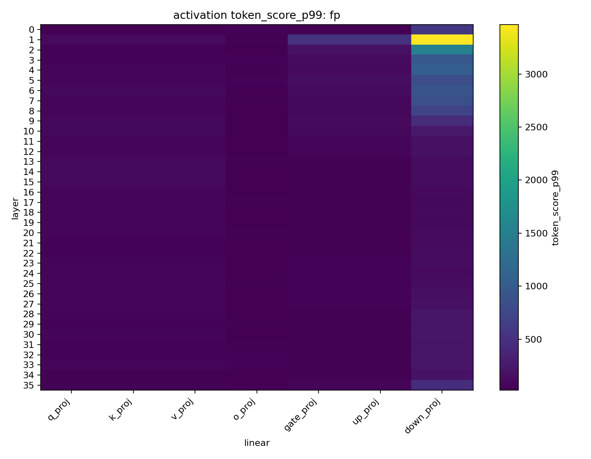

Baseline：


SVD A+B：

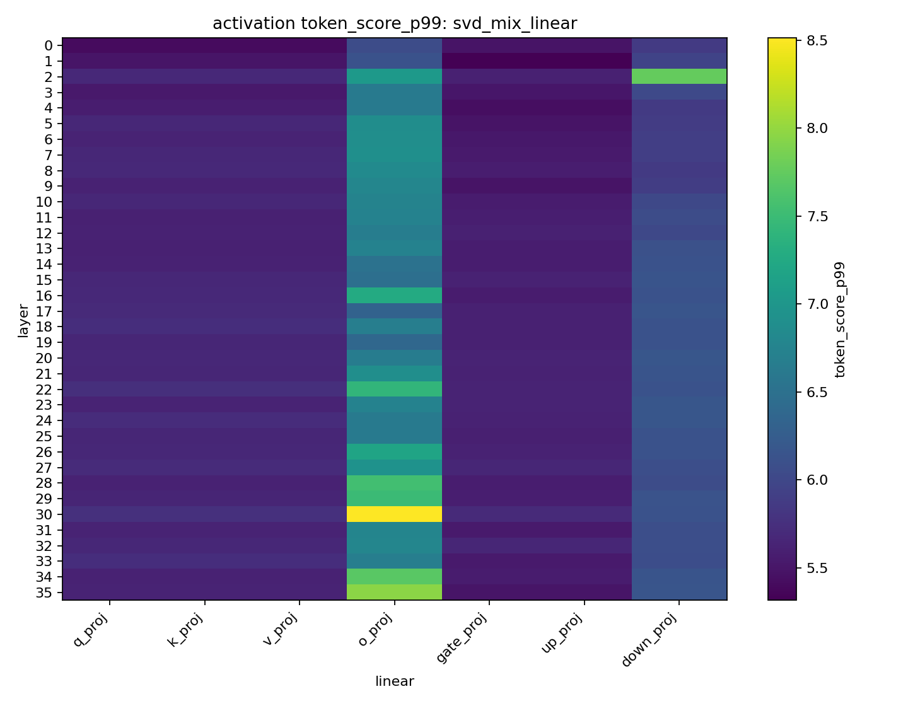

### 10.2 Activation A4 SQNR Heatmap

FP：

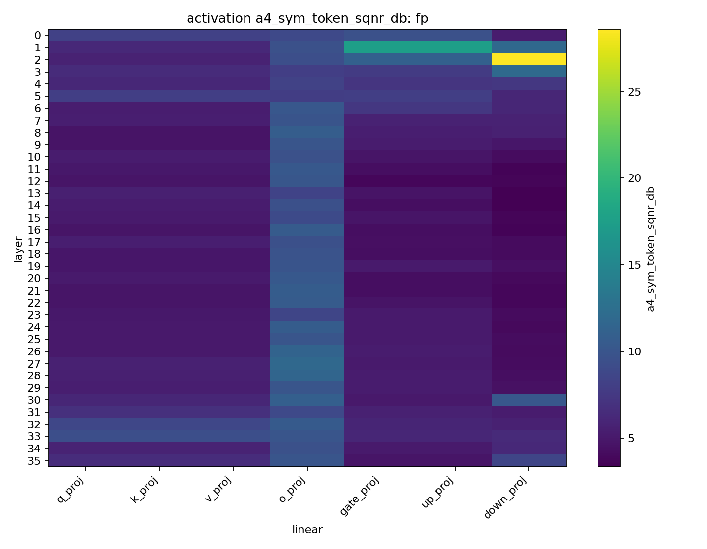

Baseline：

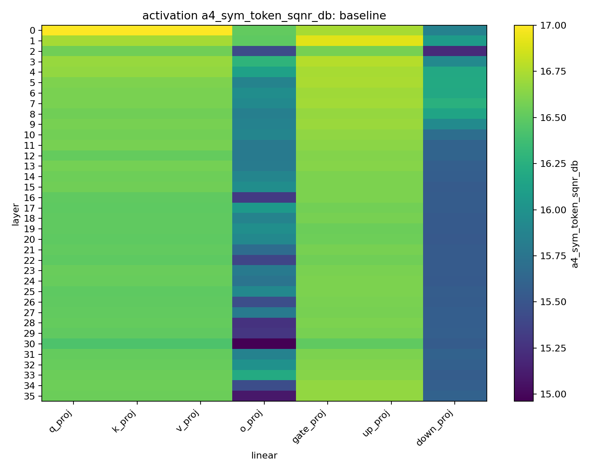

SVD A+B：


### 10.3 Weight Outlier Heatmap

FP：

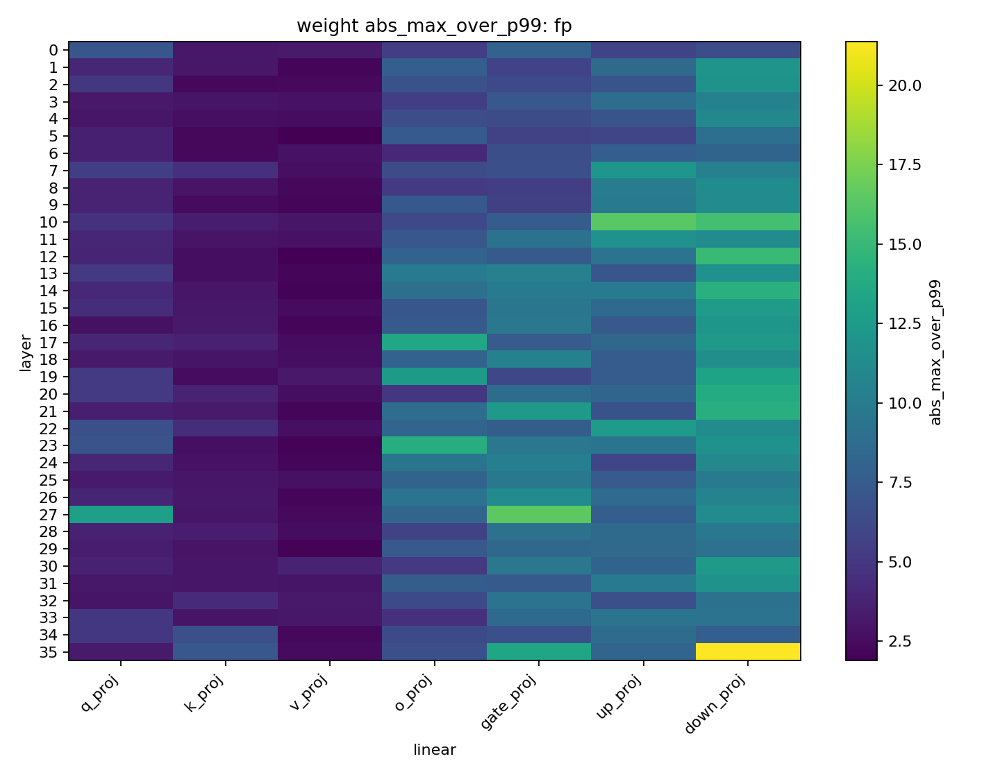

Baseline：

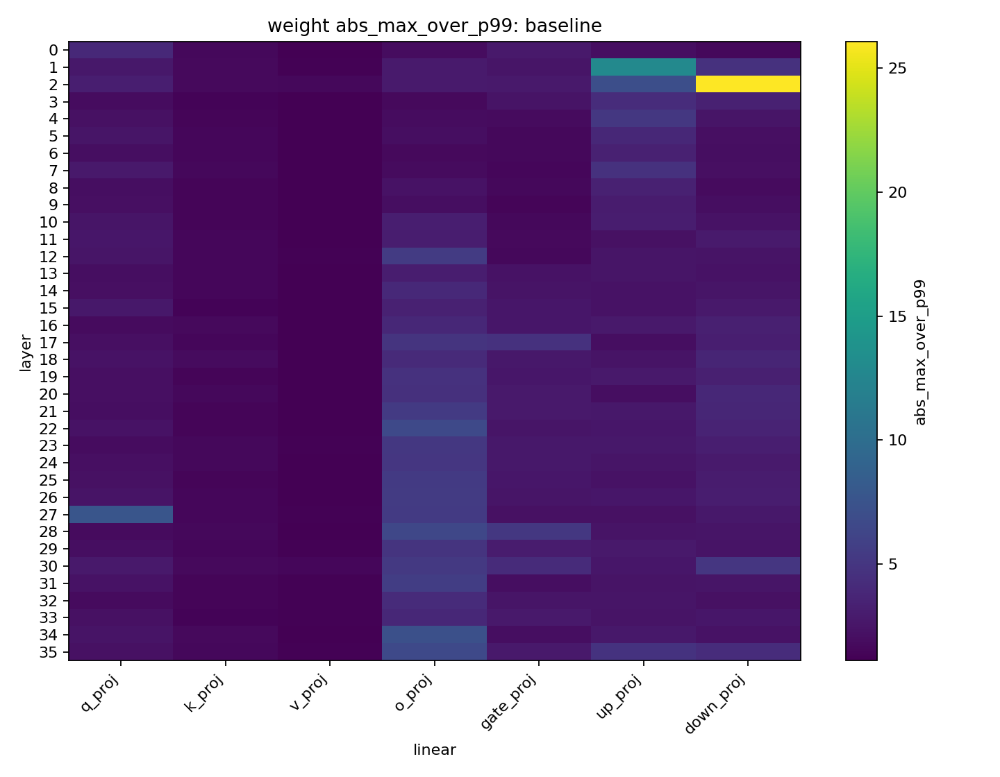

SVD A+B：

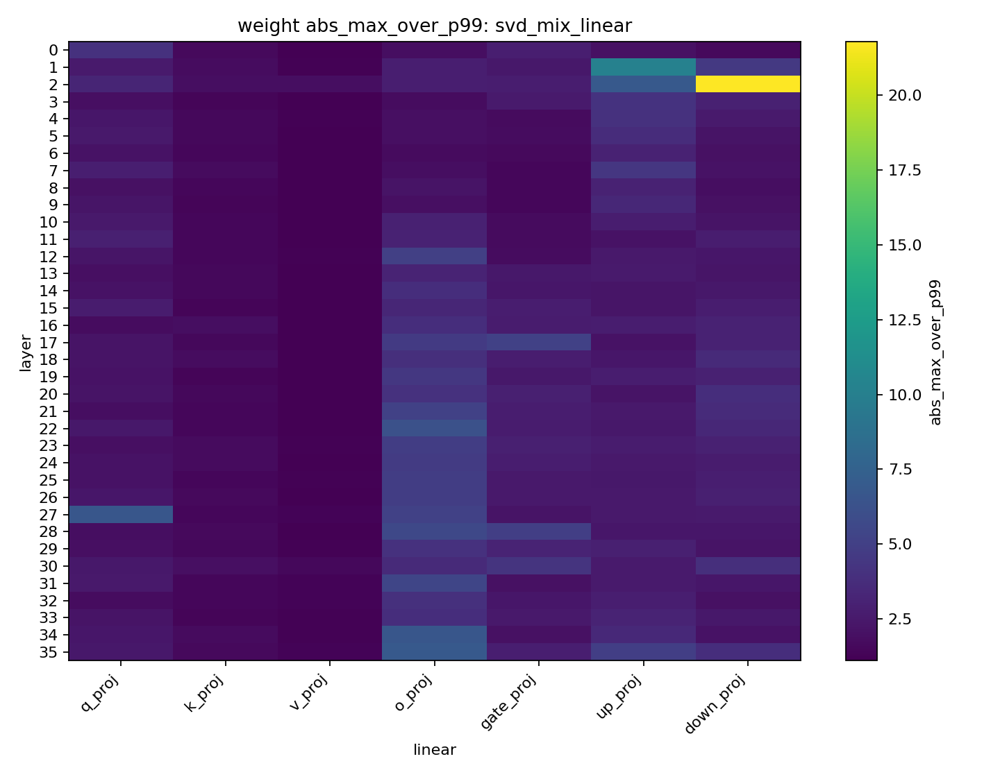

### 10.4 代表性 Histogram

Layer 35 `down_proj` activation：

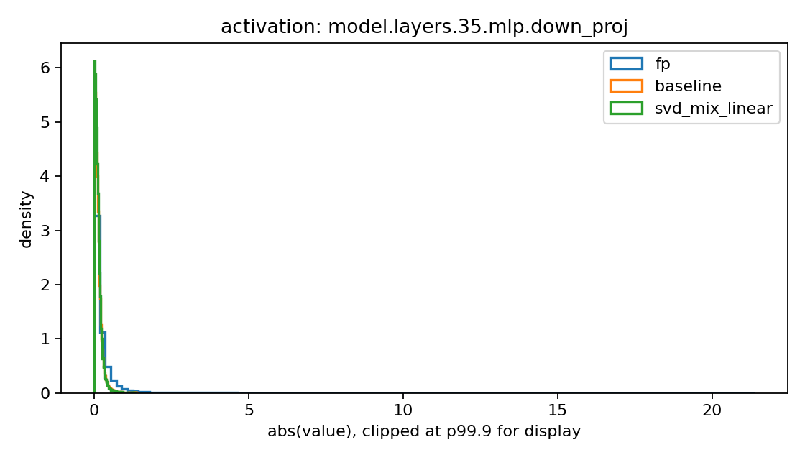

Layer 35 `down_proj` weight：

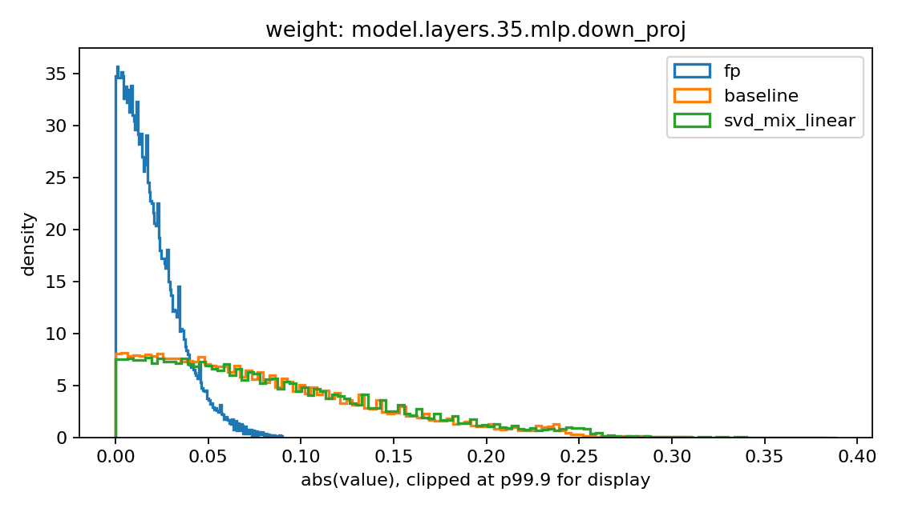

Layer 34 `o_proj` activation：

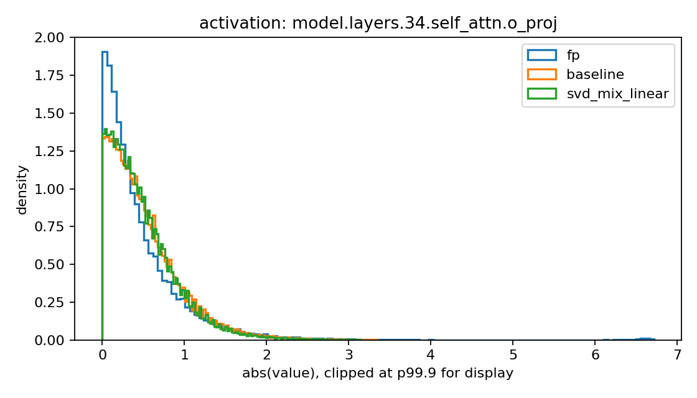

Layer 34 `o_proj` weight：

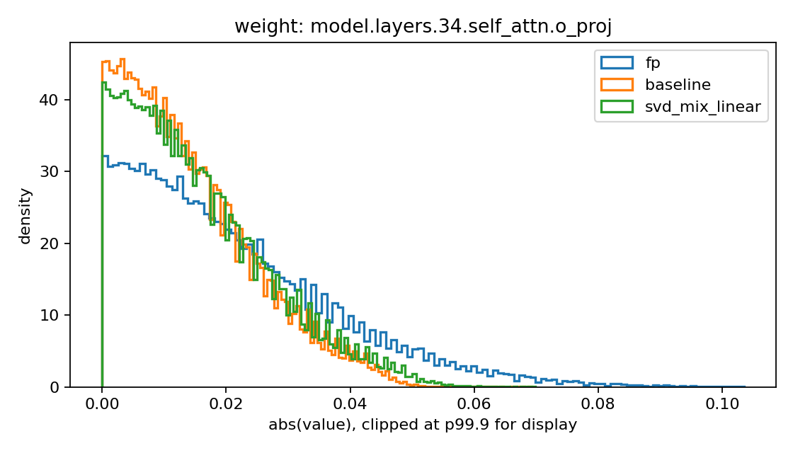

## 11. 解释

### 11.1 Baseline FlatQuant 有很强的分布效果

FP activation 分布中存在非常大的 token/channel outlier。例如 activation summary 显示：

- FP `token_score_p99` mean: `119.0528`
- baseline `token_score_p99` mean: `5.8646`
- FP `a4_sym_token_sqnr_db` mean: `6.4133`
- baseline `a4_sym_token_sqnr_db` mean: `16.3468`

这说明 established FlatQuant baseline 已经完成了预期的量化变换：它显著降低 token outlier，并让 activation 分布更适合 A4 量化。

### 11.2 SVD A+B 没有带来强的新分布 flattening 效果

与 baseline 相比，SVD A+B 没有稳定改善 token outlier score 或 A4 SQNR：

- baseline `token_score_p99` mean: `5.8646`
- SVD A+B `token_score_p99` mean: `5.8688`
- baseline `a4_sym_token_sqnr_db` mean: `16.3468`
- SVD A+B `a4_sym_token_sqnr_db` mean: `16.3404`

对于 weights，SVD A+B 略微降低了一些 outlier ratio，但这没有转化成更好的 W4 SQNR：

- baseline `abs_max_over_p99` mean: `2.6596`
- SVD A+B `abs_max_over_p99` mean: `2.5746`
- baseline `w4_sym_per_out_sqnr_db` mean: `19.4555`
- SVD A+B `w4_sym_per_out_sqnr_db` mean: `19.4392`

因此，A+B 方法有局部分布效果，但不是一个强的全局 distribution-uniformization 方法。

### 11.3 与 `head_proxy_mse` 的关系

之前的 `head_proxy_mse` 诊断显示，SVD 方法可以在若干层改善 output-head-sensitive geometry，尤其是 late layers。

本次分布诊断展示了另一个不同但兼容的结果：

- SVD A+B 可以改变 error geometry
- 但它没有清晰地让普通 weight / activation 分布比 baseline 更适合量化

因此，当前 SVD A+B 方法应该主要被理解为一种 error-geometry reweighting 方法，而不是额外的 outlier-removal 或 distribution-flattening 方法。

这也解释了为什么最终 PPL 和 zero-shot 收益有限：该方法影响了语义动机相关的方向，但没有在 established FlatQuant baseline 之上带来强的分布层面量化优势。

## 12. 结论

本轮机制层面的结论是：

1. Established FlatQuant baseline 显著降低了 outlier-dominated FP activation distributions，并让它们更适合量化。
2. 当前 A+B SVD 方法没有在 baseline 之上提供清晰的额外全局 distribution-flattening 效果。
3. A+B SVD 当前的收益更适合被描述为改变 output-head-sensitive error geometry，这与之前的 `head_proxy_mse` 发现一致。
4. 缺少强分布改善，是 A+B 没有产生全面 PPL 改善的一个合理原因。

## 13. 后续实验

下一步诊断应该从两个方向扩展本报告。

### 13.1 KL 风格的分布比较

老师建议了类似蒸馏的 KL 分析。实际下一版可以计算以下状态之间的 histogram KL / JS divergence：

- FP 和 baseline
- baseline 和 SVD A+B
- FP 和 SVD A+B

可选分布包括：

- normalized absolute activation histograms
- token outlier score histograms
- channel max histograms
- quantization error histograms

JS divergence 可能比 raw KL 更合适，因为它是对称的，并且对 histogram 比较更数值稳定。

### 13.2 语义 / Head-Sensitive Loss 对齐

为了把分布分析和 SVD 动机联系起来，后续报告应该在同一批 layer 上联合绘制：

- `plain_mse`
- `head_proxy_mse`
- token outlier metrics
- A4/W4 SQNR

这可以直接测试 `head_proxy_mse` 改善的层是否也有分布侧变化，或者该改善是否只是 output-head-induced metric 下的几何变化。
